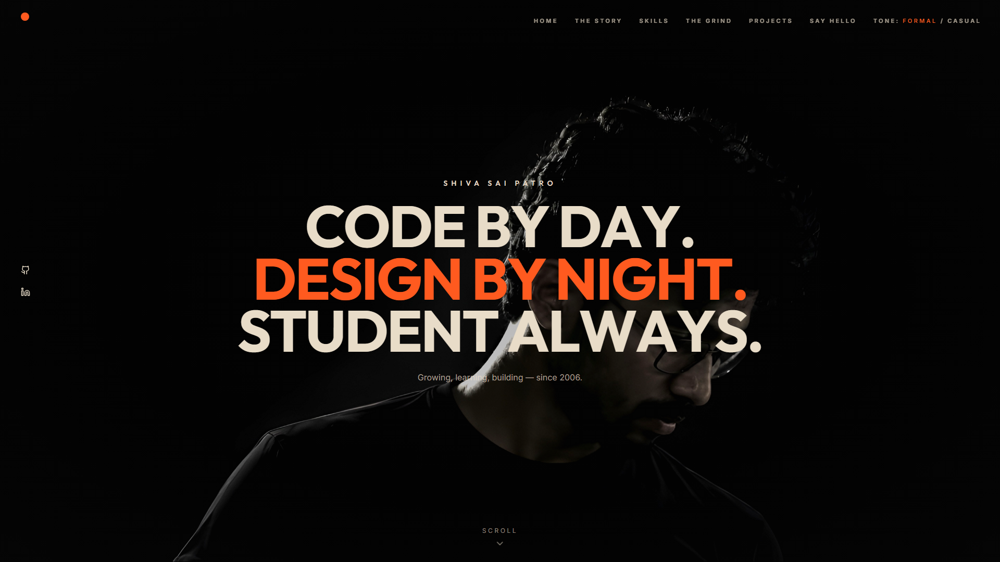
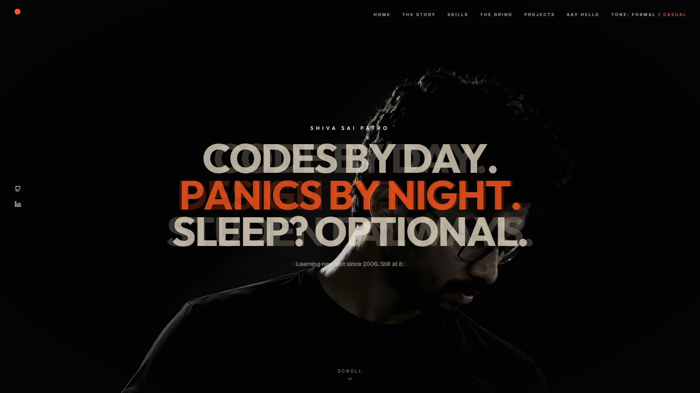
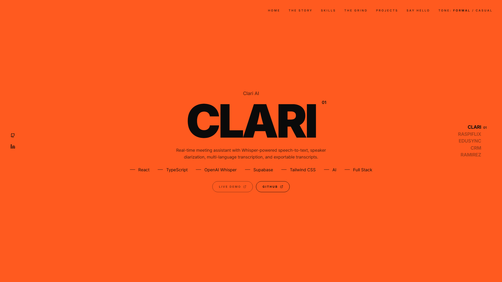

# Shiva Sai Patro — Portfolio

**Code by day. Design by night. Student always.** A dark, type-driven personal site with an animated intro, a formal / casual tone switch and scroll-driven sections.

<p align="center">
  
  <br />
  <em>The orange dot that loads the site — logo and progress indicator in one</em>
</p>

<table>
  <tr>
    <td width="33%"></td>
    <td width="33%"></td>
    <td width="33%"></td>
  </tr>
  <tr>
    <td align="center"><sub>Hero</sub></td>
    <td align="center"><sub>Formal → casual, mid-crossfade</sub></td>
    <td align="center"><sub>Stacked project cards</sub></td>
  </tr>
</table>

## Features

- **Loading intro** — the orange dot fills with real load progress (it never runs ahead of the site downloading underneath), "STILL LEARNING." and "ALWAYS BUILDING." dissolve through canvas-drawn smoke, then the dot glides into the corner and stays as the logo. Plays once per session, is skipped with reduced motion, and any click or key skips it.
- **Formal / casual tone** — every section is written twice; the nav toggle crossfades between the two, and the hero's cursor disc previews the other tone.
- **Letter-by-letter hero reveal** as the intro hands off.
- **Scroll-driven sections** — The Story, Experience (text lights up as you scroll), History, Skills, The Grind (LeetCode, Codeforces and CodeChef stats plus the GitHub contribution graph), stacked sticky Projects, and a Say Hello form above an animated crowd.
- **Custom cursor** with a hover ring and spotlight on mouse / trackpad devices; touch devices keep the native one.
- **Mobile menu** — a full-screen nav below the `md` breakpoint.

## Built With

- [React 19](https://react.dev) + [TypeScript](https://www.typescriptlang.org)
- [Vite 6](https://vite.dev)
- [Tailwind CSS 4](https://tailwindcss.com)
- [GSAP](https://gsap.com) + ScrollTrigger — hero reveal and scroll animations
- [Motion](https://motion.dev) — the preloader and the dot's move to the nav
- [Lucide](https://lucide.dev) icons
- [Playwright](https://playwright.dev) (dev only) — captures the README GIF and screenshots

## Getting Started

**Prerequisites:** Node.js 22.18 or newer (the capture scripts run TypeScript directly with Node).

```bash
npm install
npm run dev       # http://localhost:3000
npm run build     # production build in dist/
npm run preview   # serve the build locally
```

### Refreshing the README visuals

Keep `npm run dev` running in one terminal and run these in a second one. You'll also need [ffmpeg](https://ffmpeg.org) on your `PATH` (on Windows: `winget install Gyan.FFmpeg`).

```bash
npx playwright install chromium   # first time only
npm run capture:preloader         # records captures/preloader.webm and prints the ffmpeg command
npm run capture:screenshots       # writes docs/hero.png, docs/tone-toggle.png, docs/projects.png
```

Then run the ffmpeg command that `capture:preloader` printed. The trim times at the front come from that recording, so it looks like this:

```bash
ffmpeg -y -ss 0.00 -t 10.32 -i captures/preloader.webm -vf "fps=12,scale=960:-1:flags=lanczos,split[a][b];[a]palettegen=max_colors=128:stats_mode=diff[p];[b][p]paletteuse=dither=bayer:bayer_scale=5:diff_mode=rectangle" -loop 0 docs/preloader-demo.gif
```

`captures/` is gitignored. Commit what lands in `docs/`.

## Structure

```
├── App.tsx                  # shell: preloader, nav + tone toggle, lazy-loaded portfolio
├── components/
│   ├── Preloader.tsx        # intro: dot fill → two text beats → hero
│   ├── Loader.tsx           # smoke-dissolve text and load-progress helpers for the intro
│   ├── BrandDot.tsx         # the orange dot: progress pie while loading, logo after
│   ├── Overlay.tsx          # every page section
│   ├── ProjectsStack.tsx    # sticky stacked project cards
│   ├── CrowdCanvas.tsx      # animated crowd under the contact form
│   ├── ToneContext.tsx      # formal / casual state and crossfading copy
│   └── CustomCursor.tsx     # cursor, hover ring and spotlight
├── constants.tsx            # projects, skills, experience and education content
├── public/                  # images
├── resume.html              # standalone résumé page
├── scripts/                 # Playwright capture scripts for the README visuals
└── docs/                    # README GIF and screenshots
```

## Contact

- GitHub — [@Shiva-Sai-369](https://github.com/Shiva-Sai-369)
- LinkedIn — [B Shiva Sai Patro](https://www.linkedin.com/in/b-shiva-sai-patro-126aa3318/)
- LeetCode — [Sh1vz](https://leetcode.com/u/Sh1vz/) · Codeforces — [sh1vz](https://codeforces.com/profile/sh1vz) · CodeChef — [shivs2006](https://www.codechef.com/users/shivs2006)
